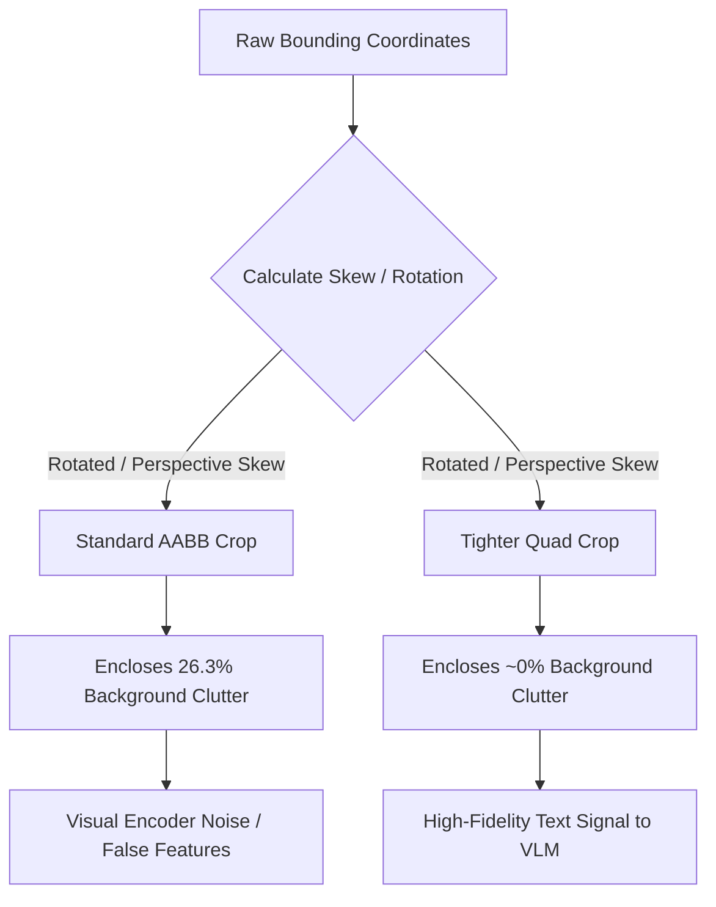

# Empirical Dataset Analysis & Training Strategy
## Project: Edge-VLM for Degraded Drone OCR

This document compiles the quantitative findings, mathematical formulations, and engineering strategies derived from the initial exploration of the ICDAR 2015 dataset. These details serve as robust empirical support and methodological foundations for your research paper.

---

## 1. Executive Summary: What the Data Just Told Us

The exploratory analysis of the ICDAR 2015 scene text dataset reveals a critical mismatch between standard object detection paradigms (axis-aligned bounding boxes) and the physical realities of incidental scene text. 

| Metric / Finding | Quantitative Value | Percentage / Context | Mathematical & Practical Implications |
| :--- | :--- | :--- | :--- |
| **Total Images Analysed** | 1,000 | Uniform 1280×720 | Simplifies preprocessing; guarantees constant aspect ratios. No dynamic resizing gymnastics needed. |
| **Total Raw Annotations** | 11,886 | 100% | Total labeled bounding regions across the training split. |
| **Illegible Text (`###`)** | 7,418 | **62.4%** | Discarded during parsing. These represent heavily blurred or out-of-focus background clutter lacking transcription. |
| **Usable Training Instances** | 4,468 | **37.6%** | Legible, fully transcribed text regions (~4.5 usable regions per image). This is the actual active training set. |
| **Rotated / Non-Horizontal Text** | 2,348 / 4,468 | **52.6%** | Over half of all usable text instances exhibit non-trivial rotation or perspective skew. **Axis-aligned boxes mathematically fail here.** |
| **Average Area Efficiency Ratio** | 0.737 | **26.3% Area Wasted** | On average, more than a quarter of every axis-aligned bounding box consists of background noise, not text pixels. |
| **Poorly Fitted Axis-Aligned Boxes** | 3,609 / 4,468 | **80.8%** | Over 4 out of 5 text instances have an area fit under 90%. Only ~19.2% fit neatly inside an axis-aligned box. |

---

## 2. The Case for Quadrilateral Representational Primitives

### 2.1 The Mathematical Limitation of Axis-Aligned Bounding Boxes (AABB)
When a text instance is rotated or subjected to perspective distortion (common in drone telemetry and Google Glass captures), an axis-aligned bounding box $B_{\text{AABB}}$ must expand to span the extreme minimum and maximum coordinates:
$$x_{\text{min}} = \min(x_1, x_2, x_3, x_4), \quad x_{\text{max}} = \max(x_1, x_2, x_3, x_4)$$
$$y_{\text{min}} = \min(y_1, y_2, y_3, y_4), \quad y_{\text{max}} = \max(y_1, y_2, y_3, y_4)$$

The area of this axis-aligned bounding box is:
$$\text{Area}(B_{\text{AABB}}) = (x_{\text{max}} - x_{\text{min}}) \times (y_{\text{max}} - y_{\text{min}})$$

### 2.2 Calculating True Quadrilateral Area (Shoelace Formula)
To determine the true area occupied by the text quadrilateral, we apply the **Shoelace Formula (Gauss's Area Formula)** for a non-self-intersecting polygon with vertices $(x_i, y_i)$ for $i \in \{1, 2, 3, 4\}$:
$$\text{Area}(B_{\text{Quad}}) = \frac{1}{2} \left| \sum_{i=1}^{n} (x_i y_{i+1} - x_{i+1} y_i) \right|$$
where $(x_{n+1}, y_{n+1}) = (x_1, y_1)$. Expanding this for our 4-point quadrilateral:
$$\text{Area}(B_{\text{Quad}}) = \frac{1}{2} \left| (x_1 y_2 - x_2 y_1) + (x_2 y_3 - x_3 y_2) + (x_3 y_4 - x_4 y_3) + (x_4 y_1 - x_1 y_4) \right|$$

### 2.3 Empirical Area Waste Metric
We define the **Area Fit Ratio** ($\Phi$) as:
$$\Phi = \frac{\text{Area}(B_{\text{Quad}})}{\text{Area}(B_{\text{AABB}})}$$

* **$\Phi = 1.0$**: Perfect alignment (the text region is perfectly horizontal and rectangular).
* **$\Phi < 1.0$**: Wasted area. The remaining fraction $(1 - \Phi)$ represents background noise, non-textual textures, or adjacent clutter enclosed within the bounding box.

Our empirical result of **$\bar{\Phi} = 0.737$** means that **26.3% of the pixels passed to the model within a standard bounding box crop are irrelevant background noise**. In low-parameter, edge-deployed VLMs, forcing the visual encoder to process this noise severely degrades token representation efficiency and spatial grounding accuracy.



---

## 3. Training & Data Augmentation Strategy

To make our model robust to severe environmental degradations (e.g., motion blur, defocus, compression noise, atmospheric haze) typical of edge-based drone operations, we must prevent overfitting while maximizing the training yield of 4,468 legible instances.

### 3.1 The Principle of Coordinate Invariance under Visual Degradation
A major mathematical advantage of spatial-autoregressive OCR grounding is that **coordinate labels are invariant to pixel-level degradations**. Applying a Gaussian blur, motion blur, or noise operation $\mathcal{D}$ to an image $\boldsymbol{I}$ changes the visual texture but leaves the geometric coordinates of the text unaltered:
$$\text{Location}(\text{Text}(\mathcal{D}(\boldsymbol{I}))) \equiv \text{Location}(\text{Text}(\boldsymbol{I}))$$

This allows us to scale our training set dramatically without needing manual re-annotation or geometric coordinate transformations.

### 3.2 Dataset Multiplier Pipeline
We will implement an online/offline augmentation pipeline that expands our training set by **3x to 4x** ($4,468 \to \sim 13,000 - 18,000$ instances):

1. **Clean Originals (1x)**: Kept fully intact. This ensures the model maintains a strong baseline capability on high-quality captures.
2. **Motion Blurred Copies (1x)**: Simulates camera shake and drone translation/vibration.
3. **Defocus / Lens Blurred Copies (1x)**: Simulates autofocus hunting or incorrect depth-of-field calibration on edge sensors.
4. **Gaussian Noise / Compression Artifacts (1x)**: Simulates low-light sensor noise and high-compression telemetry feeds.

By mixing clean and degraded versions of the same images in the training batches, the VLM learns a **degradation-invariant representation**. It learns to ignore the high-frequency pixel noise and focus purely on the structural, geometric visual primitives of the characters.

---

## 4. Proposed Paper Methodology & Ablation Plan

To turn this into a premium, publishable paper, we propose the following systematic ablation study:

```
                                  [ Raw ICDAR 2015 Dataset ]
                                              |
                                    +---------+---------+
                                    |                   |
                           [ Baseline Study ]     [ Proposed Study ]
                                    |                   |
                              Axis-Aligned         Quadrilateral
                             Boxes (<box>)        Points (<quad>)
                                    |                   |
                                    +---------+---------+
                                              |
                                    [ Degradation Mixes ]
                                              |
                                   [ Downstream OCR / VQA ]
```

### Phase 1: The Baseline (Axis-Aligned)
* **Representation**: XML tags `<ref>text</ref><box>[[x1,y1,x2,y2]]</box>`.
* **Behavior**: Normalizes coordinates to a $[0, 1000]$ integer grid.
* **Goal**: Proves the foundational training pipeline is functional and serves as a direct comparison against standard paradigms (like DeepSeek's default setup).

### Phase 2: The Extension (Quadrilateral)
* **Representation**: XML tags `<ref>text</ref><quad>[[x1,y1,x2,y2,x3,y3,x4,y4]]</quad>`.
* **Behavior**: Maps coordinates clockwise starting from the top-left vertex: $\text{TL} \to \text{TR} \to \text{BR} \to \text{BL}$.
* **Goal**: Demonstrates that generating tighter, non-axis-aligned polygons leads to a direct and statistically significant increase in Exact Match (EM) OCR accuracy, especially under drone-simulated degradations.
